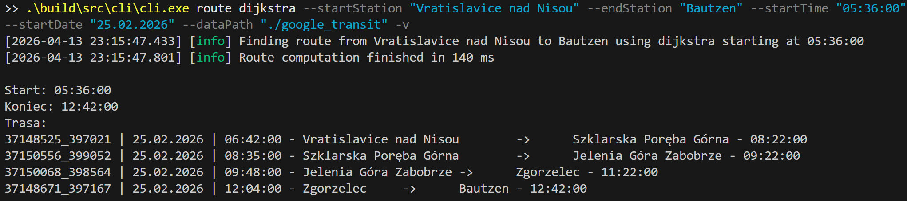
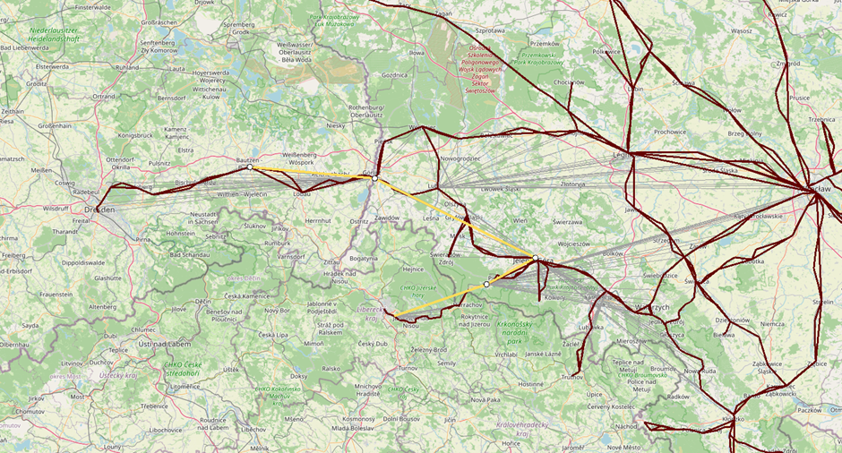
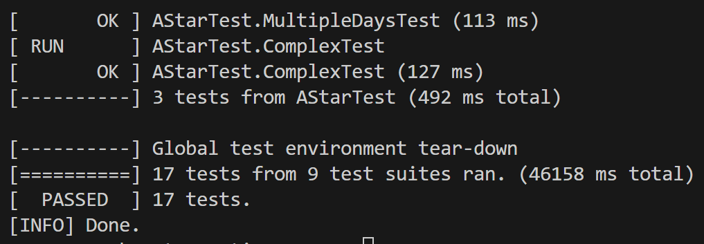
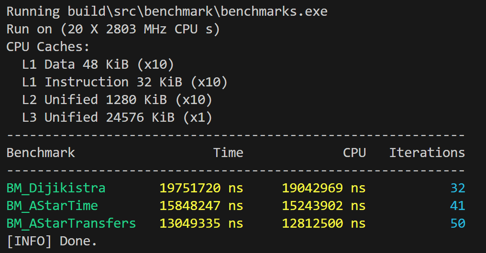

# Transit Router

This is a C++ solution to the Traveling Salesman Problem (TSP) based on <a href="https://developers.google.com/transit/gtfs">Google's GFTS</a> data (in this case, there is provided one from <a href="https://kolejedolnoslaskie.pl/">Koleje Dolnośląskie (Polish railway)</a>).

The app is divided into four major parts:

- [Core](#core) - Contains all algorithms related to solving traveling problems.
- [CLI](#cli) - An implementation for CLI functions.
- [GUI](#gui) - Provides visualization for a given traversing problem.
- [Benchmark](#benchmark) - Compares how fast the algorithms are.

### Table of Contents

- [How to Use](#how-to-use)
- [Architecture](#architecture)
- [Building and Running](#building-and-running)

## How to Use

This app can show you the fastest route between stations. The inputs it accepts are the names of the stations, and the date & hour of departure.
The program has 2 modes of operation:

- **From station 'A' to 'B'** - The program will return the fastest or least-transfer path to get from station A to station B.
- **From station 'A' to many stations 'B','C','D' ... and back to 'A'** - The program will return the best path starting from station 'A' to visit all of those stations in the most-efficient way, coming back to 'A'.

It features 3 algorithms you can choose from:

- **Dijkstra** - Explores the whole graph to find the best time-efficient way to get from station 'A' to 'B'.
- **Heuristic Time A-Star** - Explores the necessary part of the graph (based on a distance heuristic) to find the best time-efficient way to get from station 'A' to 'B'.
- **Heuristic Transfer A-Star** - Explores the necessary part of the graph (based on a distance heuristic) to find the best least-transfer way to get from station 'A' to 'B'. It also uses a Pareto frontier optimization to discard paths that are suboptimal in both travel time and number of transfers.

Additionally, you can choose **Tabu Search**, which, combined with one of the mentioned algorithms, will solve the problem for many stations. Tabu search uses short-term memory to avoid looping and aspiration criteria to help find the global-best solution.

## Architecture

### Core

The core library is the heart of the application, containing all the logic for data loading, graph representation, and pathfinding algorithms. It's designed to be a standalone module that can be used by different frontends (like CLI or GUI).

### CLI

The Command-Line Interface allows you to interact with the application using text commands. It's perfect for scripting and quick queries.



#### Available Commands

The CLI supports two main commands: `route` for finding a path between two points, and `tabu` for solving the multi-point traveling salesman problem.

**1. `route` command**

Finds the best connection between two stations using a specified algorithm.

**Usage:**

```bash
cli.exe route <algorithm> --startStation "Station A" --endStation "Station B" [options]
```

- `<algorithm>`: The algorithm to use.
  - `dijkstra`: Finds the fastest path by exploring the entire graph.
  - `astar_time`: Finds the fastest path using a time-based heuristic.
  - `astar_transfer`: Finds the path with the minimum number of transfers.
- `--startStation <name>`: The name of the starting station.
- `--endStation <name>`: The name of the destination station.
- `--startTime <HH:MM:SS>`: The desired departure time.
- `--startDate <DD.MM.YYYY>`: The desired departure date.
- `--verbose` or `-v`: (Optional) Enables detailed logging of the pathfinding process.

**2. `tabu` command**

Solves the Traveling Salesman Problem to find the optimal route that visits multiple stations and returns to the start.

**Usage:**

```bash
cli.exe tabu <algorithm> --startStation "Start Station" --stations "Station 1" "Station 2" ... [options]
```

- `<algorithm>`: The base algorithm (`dijkstra`, `astar_time`, `astar_transfer`) to calculate costs between individual stations.
- `--startStation <name>`: The starting and ending station for the trip.
- `--stations <name...>`: A list of stations to visit.
- `--startTime <HH:MM:SS>`: The desired departure time.
- `--startDate <DD.MM.YYYY>`: The desired departure date.

### GUI

The Graphical User Interface provides an interactive map to visualize the stations, routes, and the final path found by the algorithms. It uses SFML for rendering and CPR for fetching map tiles from OpenStreetMap.



### Tests

The project has a comprehensive test suite using the Google Test framework to ensure the correctness of algorithms and utility functions.



### Benchmark

Benchmarks are implemented using the Google Benchmark library to measure and compare the performance of the different pathfinding algorithms.



## Building and Running

### Prerequisites

- A C++23 compatible compiler (Clang, GCC, or MSVC)
- CMake (version 3.20 or newer)
- Ninja (recommended build system)

### Building

To build the project, run the `build.bat` script. You can specify what to build and in which configuration.

**Build all components in Debug mode:**

```bash
build.bat all Debug
```

**Build only the CLI in Release mode:**

```bash
build.bat cli Release
```

**Run Linter:**
The project is configured with `clang-tidy` to ensure code quality. You can run the linter with the following command:

```bash
build.bat lint
```

### Running

**CLI:**
Navigate to the `build/src/cli` directory and run the executable with the desired arguments.

```bash
# Example: Find a route using Dijkstra
./cli.exe route dijkstra --startStation "Wrocław Główny" --endStation "Jelenia Góra" --startTime "08:00:00" --startDate "15.04.2026"
```

**GUI:**
Run the `gui.exe` executable from the `build/src/gui` directory.

```bash
./gui.exe
```
